# 🌲 SAR树生成指南

## 问题诊断

运行 `create_tree.py` 失败，原因：
- ❌ `SAR_Results/SAR_Tables/Combine_Table_info.csv` 不存在
- ⚠️ `grid_pos_utils.py` 的 MCS 导入警告（已修复）

---

## 解决方案

### 方案1：生成新的SAR表格（推荐）

首先运行 `create_sarm.py` 生成SAR表格：

```bash
# 激活环境
micromamba activate autoSAR2

# 生成SAR表格到 SAR_Results 目录
python create_sarm.py \
    --csvFile SAR_Results/input.csv \
    --column IC50_uM \
    --type smiles \
    --log 1 \
    --minimumSite1 3 \
    --minimumSite2 3 \
    --n_jobs 8 \
    --save_folder SAR_Results \
    --csv2excel 1
```

然后再运行 `create_tree.py`：

```bash
python create_tree.py \
    --fragment_core "*CN1CCC(c2ccc3[nH]c(-c4cc(CO*)c5ncnn5c4)c(C(C)C)c3c2)CC1" \
    --rootTitle "Table_100_combine" \
    --workFolder ./SAR_Results \
    --maxLevel 5 \
    --treeContent "['double-cut','single-cut']" \
    --highlightDict "[{'col':'IC50_uM', 'type':'means', 'relation':'<', 'value':1.0}]"
```

---

### 方案2：使用已有数据

如果想使用 CDK1-2 的数据：

```bash
python create_tree.py \
    --fragment_core "*CN1CCC(c2ccc3[nH]c(-c4cc(CO*)c5ncnn5c4)c(C(C)C)c3c2)CC1" \
    --rootTitle "Table_100_combine" \
    --workFolder ./CDK1-2/CDK2_SMILES \
    --maxLevel 5 \
    --treeContent "['double-cut','single-cut']" \
    --highlightDict "[{'col':'IC50_uM', 'type':'means', 'relation':'<', 'value':1.0}]"
```

**注意**：需要确保以下文件存在：
- `CDK1-2/CDK2_SMILES/Combine_Table_info.csv` (double-cut 数据)
- `CDK1-2/CDK2_SMILES/singleCut_Table_info.csv` (single-cut 数据，如果需要)

---

## 工作流程说明

### 完整SAR分析流程

```mermaid
graph LR
    A[原始数据 input.csv] --> B[create_sarm.py]
    B --> C[SAR表格生成]
    C --> D[create_tree.py]
    D --> E[SAR树可视化]
```



1. **步骤1**: 准备数据
   - 创建 `input.csv`，包含 SMILES 和活性数据列

2. **步骤2**: 生成SAR表格
   ```bash
   python create_sarm.py --csvFile input.csv --column ActivityColumn
   ```

3. **步骤3**: 生成SAR树
   ```bash
   python create_tree.py --workFolder ./SAR_Results --rootTitle TableName
   ```

---

## 已修复问题

✅ **grid_pos_utils.py MCS 弃用警告**
```python
# 修改前
from rdkit.Chem import MCS

# 修改后  
from rdkit.Chem import rdFMCS as MCS
```

---

## 参数说明

### create_tree.py 关键参数

| 参数 | 说明 | 示例 |
|------|------|------|
| `--fragment_core` | 核心片段SMILES（*表示连接点） | `"*CN1CCC..."` |
| `--rootTitle` | 根节点表格名称 | `"Table_100_combine"` |
| `--workFolder` | 工作目录（包含SAR_Tables） | `./SAR_Results` |
| `--maxLevel` | 树的最大深度 | `5` |
| `--treeContent` | 树内容类型 | `"['double-cut','single-cut']"` |
| `--highlightDict` | 高亮条件 | `"[{'col':'IC50_uM'...}]"` |

### highlightDict 格式

```python
[
    {
        'col': 'IC50_uM',      # 数据列名
        'type': 'means',       # 统计类型: means/stds/medians
        'relation': '<',       # 关系: < / = / >
        'value': 1.0          # 阈值
    }
]
```

---

## 故障排查

### 错误1: FileNotFoundError
```
FileNotFoundError: SAR_Tables/Combine_Table_info.csv
```
**原因**: 未运行 create_sarm.py 或 workFolder 路径错误  
**解决**: 检查 workFolder，确保包含 SAR_Tables 目录

### 错误2: MCS DeprecationWarning
```
DeprecationWarning: rdkit.Chem.MCS module is deprecated
```
**状态**: ✅ 已修复（grid_pos_utils.py 已更新）

### 错误3: 列名不存在
```
KeyError: 'IC50_uM'
```
**原因**: highlightDict 中的列名与数据不匹配  
**解决**: 检查 Combine_Table_info.csv 的列名，使用正确的列名

---

## 数据准备检查清单

运行前确认：

- [ ] `workFolder/SAR_Tables/Combine_Table_info.csv` 存在
- [ ] CSV文件包含 SMILES 或 Key2 列
- [ ] highlightDict 中的列名存在于数据中
- [ ] fragment_core 在 rootTitle 表格中存在
- [ ] treeContent 与可用数据匹配

---

## 示例：完整工作流

```bash
# 1. 激活环境
micromamba activate autoSAR2

# 2. 生成SAR表格
python create_sarm.py \
    --csvFile data/molecules.csv \
    --column pIC50 \
    --type smiles \
    --n_jobs 8 \
    --save_folder MY_SARM_RESULTS

# 3. 查看生成的表格
ls MY_SARM_RESULTS/SAR_Tables/

# 4. 选择根节点（从 Combine_Table_info.csv 中选择）
# 找到感兴趣的 fragment_core

# 5. 生成SAR树
python create_tree.py \
    --fragment_core "YOUR_FRAGMENT" \
    --rootTitle "Table_XXX_combine" \
    --workFolder ./MY_SARM_RESULTS \
    --maxLevel 5 \
    --treeContent "['double-cut']" \
    --highlightDict "[{'col':'pIC50', 'type':'means', 'relation':'>', 'value':7.0}]"

# 6. 查看结果
ls MY_SARM_RESULTS/Trees/FragTree_Table_XXX_combine/
```

---

## 输出文件

成功运行后，生成：

```
workFolder/
├── SAR_Tables/
│   ├── Combine_Table_info.csv
│   ├── singleCut_Table_info.csv
│   └── ...
└── Trees/
    └── FragTree_{rootTitle}/
        ├── tree_structure.pdf
        ├── tree_data.csv
        └── fragment_images/
```

---

*文档更新时间: 2025年11月23日*
